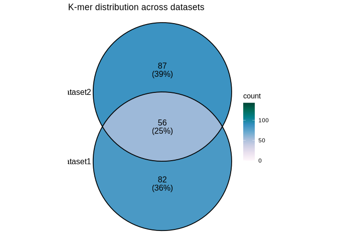
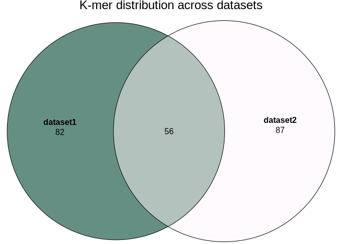
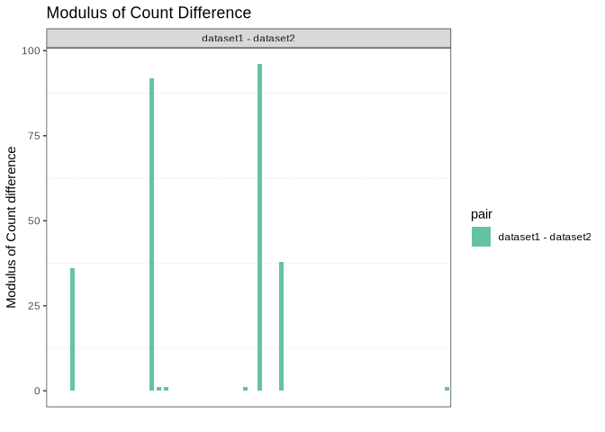
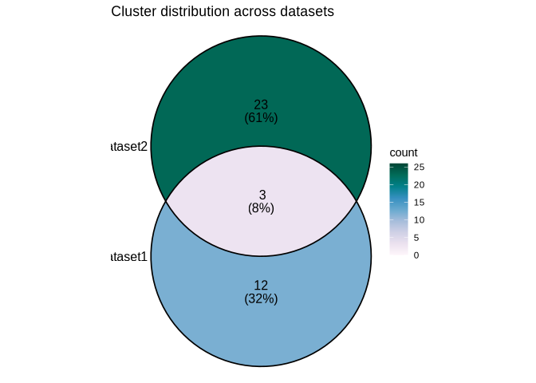
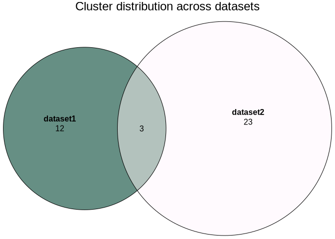
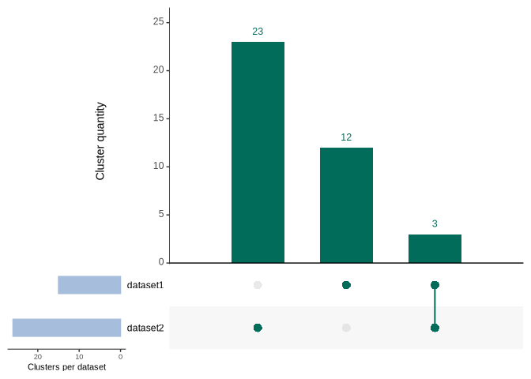
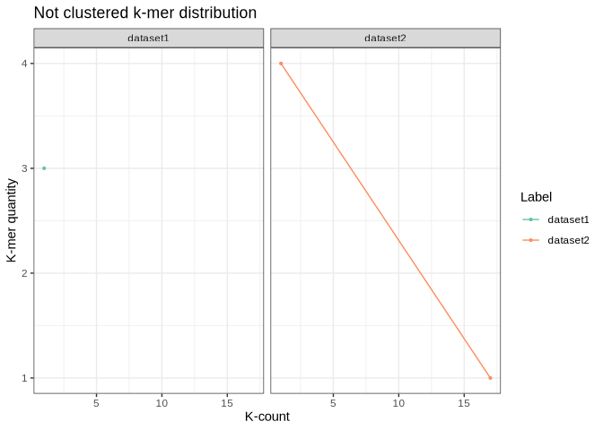

<!-- README.md is generated from README.Rmd. Please edit that file -->

# AEkcompgen :3

<!-- badges: start -->

<!-- badges: end -->

The goal of AEkcompgen is to compare genomic data between two or more
datasets, in order to find and quantify exclusive and shared sequences
between them and enable visualization of these relations. This is done
by using k-mers, subsequences of nucleotides that decrease the dataset
complexity as well as allow for patter recognition and quantification.

To do so the package has three main moments, (1) read processing, (2)
k-mer counting and (3) k-mer clustering.

## Installation :\]

Before installing it, note that some command line programs (check list
below) should be installed for full use of the package.

- [Trimommatic](https://github.com/usadellab/trimmomatic)
- [BWA](https://github.com/lh3/BWA)
- [samtools](https://github.com/samtools/samtools)
- [jellyfish](https://github.com/gmarcais/jellyfish)
- [CD-hit](https://github.com/weizhongli/cdhit)

OBS: Recommended installation via conda.

You can install `AEkcompgen` using the devtools package:

``` r
#Install devtools
#install.packages("devtools")

#Install AEkcompgen through github
#devtools::install_github("vic-ror/AEkcompgen")

#Load AEKcompgen
library(AEkcompgen)
```

## How to use? :o

### (1) Read Processing: Trimming, filtering quality, removing contaminants, checking sequencing coverage and subsampling.

First, in order to turn the sequencing .fastq into fairly comparable
datasets read processing is required.

``` r
library(AEkcompgen)
#1.Run trimommatic to trim reads.
#run_trimmomatic(mode = "PE", input = c("dataset_1_1.fastq.gz", "dataset_1_2.fastq.gz"),
#                out = c("dataset_1_1_paired.fastq.gz", "dataset_1_1_unpaired.fastq.gz",
#                        "dataset_1_2_paired.fastq.gz", "dataset_1_2_unpaired.fastq.gz"))


#2. Remove possible contaminated reads separately.
#OBS: This step can also be done by the run_bwa function, by giving it the contaminant reference genome in the contaminant_ref variable.
#run_bwa_remove_contaminant(input = c("dataset_1_1_paired.fastq.gz", "dataset_1_2_paired.fastq.gz"),
#                           output = c("dataset_1_1_paired_rm_cont.fastq.gz", "dataset_1_2_paired_rm_cont.fastq.gz"),
#                           ref = "cont_species_ref_genome.fasta")

#3. Run bwa to map into reference genome.
#run_bwa(input = c("dataset_1_1_paired_rm_cont.fastq.gz","dataset_1_2_paired_rm_cont.fastq.gz"),
#        output = "dataset_1_mapped", 
#        ref = "species_ref_genome.fasta",
#        output_format = "bam")


#4. Calculate mean read depth.
#calculate_depth(input = "dataset_1_mapped.bam")

#5. Subsample sequencing.
#subsample_sequencing(input = "dataset_1_mapped.bam",
#                     current_average_depth = 50,
#                     wanted_average_depth = 40,
#                     output = "dataset_1_mapped_subsampled")

#6. Turn .bam/.sam file into a fasta file, needed to run k-mer counter.
#mapped_file_to_fasta(input = "dataset_1_mapped_subsampled.bam",
#                     output = "dataset_1_mapped_subsampled")

#OBS: Subsampling a sequencing file is an important step to allow a fair comparison between different datasets, since different seqiencing coverage can result in different results in k-mer analysis, taking consideration parameters such as k-mer count.
```

### (2) K-mer Counting: Count k-mers with jellyfish, and verify which sequences are shared of exclusive to each given dataset.

Plot information from the counted k-mers, such as quantity of shared and
exclusive k-mers, k-mer frequency and differential count information, as
well as select the shared and exclusive sequences.

``` r
#1.Run k-mer counter
#dataset_1 <- run_jellyfish(fasta_file = "dataset_1_reads.fasta",
#                           length = 45,
#                           dataset_label = "dataset1",
#                           output = "dataset_1_jf")
#dataset_2 <- run_jellyfish(fasta_file = "dataset_2.fasta",
#                           length = 45,
#                           dataset_label = "dataset2",
#                           output = "dataset_2_jf")

  #Or load files from jellyfish, in case header is not renamed
  #rename_fasta_jf(dataset_1_no_header_name_jf.fasta,
  #                dataset_label = "dataset1") 
  #rename_fasta_jf(dataset_2_no_header_name_jf.fasta,
  #                dataset_label = "dataset2")

  #Only load file
  dataset_1 <- load_fasta("inst/extdata/git_hub_test/dataset_1_reads_jf.fasta")
  dataset_2 <- load_fasta("inst/extdata/git_hub_test/dataset_2_reads_jf.fasta")
  
#2. Visualization of the k-mer counting data
  #Run jellyfish histo
  #dataset_1_histo <- run_jellyfish_histo("dataset_1_jf.jf")
  #dataset_2_histo <- run_jellyfish_histo("dataset_2_jf.jf")
    
    #Add marker to the histogram
    marked_dataset_1_histo <- mark_jellyfish_histo(histo_file = "inst/extdata/git_hub_test/dataset_1_reads_jf.histo",
                                                   dataset_label = "dataset1")
    marked_dataset_2_histo <- mark_jellyfish_histo(histo_file = "inst/extdata/git_hub_test/dataset_2_reads_jf.histo",
                                                   dataset_label = "dataset2")
    
    #Plot the histogram and save
    histo <- plot_histogram_kmer_freq(marked_dataset_1_histo,
                                      marked_dataset_2_histo)
    
    histo
```


``` r
    
    #Save plot
    #save_plot(histo, file_name = "histogram",
    #          format = "pdf")
    

#3. Plot k-mer sharing relation
  #Get relation
    kmer_sharing_list <- kmer_sharing_relation(dataset_1, dataset_2)
#> Extracting datasets...
#> Creating lists...
    
  #Plot
    #Venn diagram
    plot_venn_kmers(kmer_sharing_list)
#> Generating Venn Diagram...
```



``` r
    #Euler diagram
    plot_euler_kmers(kmer_sharing_list)
#> Generating color palette based on the number of datasets...
#> Generating Euler Diagram...
```



``` r
    #Upset plot (Recommended for more than 3 datasets)
    plot_upset_kmers(kmer_sharing_list)
#> Generating UpsetPlot...
```


``` r
    

#4. Get exclusive and shared k-mers
    exclusive_kmers <- select_exclusive_seq(dataset_1, dataset_2)
#> 169 exclusive k-mers found!
    shared_kmers <- select_shared_seq(dataset_1, dataset_2)
#> 56 shared k-mers found!
    
#5. Plot the shared k-mers with differential count/frequency
    plot_count_diff_shared_kmers(shared_kmers)
#> Extracting k-mer count values...
#> Paring different dataset labels combination and calculating the modulus of the difference of the k-mer count...
#> Making the plot...
```



### (3) K-mer Clustering: Grouping k-mer sequences based on sequence similarity

Plot information from the clustered k-mers, such as quantity of shared
and exclusive k-mers, k-mer frequency and differential count
information, as well as select the shared and exclusive sequences.

``` r
#1.Run CD-hit to cluster sequences with 90% identity
# clustered_datasets<- run_cd_hit(data_frame = exclusive_kmers,
#                                       identity = 0.9)

#Or load .clrst CD-hit output
clustered_datasets <- load_clstr_file("inst/extdata/git_hub_test/clustered_datasets.clstr")
#> Turning .clstr file into a dataframe...

#2. Get clustering information
cd_hit_info(clustered_datasets)
#> Number of clusters: 38
#> Mean quantity of k-mers per cluster: 4.44736842105263
#> Median quantity of k-mers per cluster: 4
#> Largest cluster(s) quantity of k-mers: 23
#> Smallest cluster(s) quantity of k-mer(s): 1

#3. Plot cluster sharing relation and plot it
cluster_sharing_list <- cluster_sharing_relation(clustered_datasets)
#> Collapsing labels...
#> Creating lists for diagram based on the given datasets...

  #Venn diagramy
  plot_venn_clusters(cluster_sharing_list)
#> Generating Venn Diagram...
```



``` r
  #Euler diagram
  plot_euler_clusters(cluster_sharing_list)
#> Generating color palette based on the number of dataset...
#> Generating Euler Diagram...
```



``` r
  #Upset plot  (Recommended for more than 3 datasets)
  plot_upset_clusters(cluster_sharing_list)
#> Generating UpsetPlot...
```



``` r

#4. Select kmers from exclusive and shared clusters
exclusive_cluster_kmers <- select_exclusive_clusters(clustered_datasets)
#> 35 exclusive clusters found!
shared_cluster_kmers <- select_shared_clusters(clustered_datasets)
#> 3 shared clusters found!

#6. Select and plot clusters with ony one k-mer
##More "unique" sequences
cluster_1_seq_df <- select_clusters_1_seq(clustered_datasets,
                   path_db = NULL)

plot_cluster_1_seq(cluster_1_seq_df)
#> Extracting the k-mer count...
#> Warning: There was 1 warning in `dplyr::mutate()`.
#> ℹ In argument: `cluster = as.numeric(.data$cluster)`.
#> Caused by warning:
#> ! NAs introduced by coercion
#> Counting the quantity of clusters...
#> Generating plots...
#> `geom_line()`: Each group consists of only one observation.
#> ℹ Do you need to adjust the group aesthetic?
```



``` r

#7. Retrieve k-mer sequences
info_seq_exclusive_kmers <- retrieve_sequence(exclusive_cluster_kmers,
                                              exclusive_kmers)
```

## Warranty

Please open an issue, if you find any bugs or errors.

\##Acknowledgement The development of this package was made possible
thanks to the book [R Packages 2(e)](https://r-pkgs.org/) by Hadley
Wickham and Jennifer Bryan.
